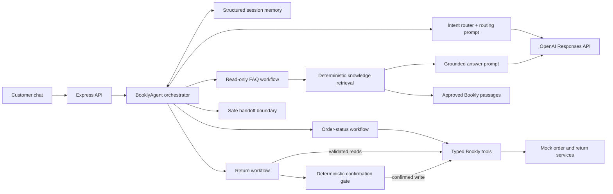

# Bookly support agent

Bookly is a small customer-support agent for an online bookstore. It supports three focused areas:

1. Check an order's status.
2. Check return eligibility and create an approved return.
3. Answer approved shipping, return-policy, and password-reset FAQs from a small grounded knowledge base.

## The thesis

> **Use AI for ambiguity; use code for commitments.**

The language model classifies customer language and extracts details. In the read-only FAQ path, it may also write a response from retrieved Bookly passages. It cannot look up an order, decide return eligibility, approve a return, or call a write tool. Explicit TypeScript workflows own those commitments.

This is intentionally not a general-purpose agent loop or an all-in-one agent framework. The narrow design makes the important behavior easy to explain, test, and trust.

## Assignment requirements -> working proof

| Requirement | Where to see it |
| --- | --- |
| Multi-turn interaction | Ask `Where is my order?`, then provide `BK-10421`, then `maya.chen@example.com`. Structured session memory carries the validated fields forward. |
| Tool use and action | Ask to return `BK-10422`, then explicitly confirm. The agent calls `lookupOrder`, `checkReturnEligibility`, and finally the mocked `createReturn` write. |
| Clarifying question | Omit an order number, email, return reason, or clear confirmation. The workflow stops and asks only for the missing information. |
| Direct LLM API calls | The intent router and grounded FAQ answerer call the OpenAI Responses API directly with Zod Structured Outputs and `store: false`. There is no agent platform between Bookly and the API. |
| General knowledge question | Ask `How long does shipping to Canada take?` The FAQ workflow retrieves approved Bookly knowledge, validates the answer's citations, and hands off instead of guessing when the knowledge base does not support an answer. |
| Depth over breadth | Bookly implements two operational workflows and one small read-only knowledge workflow. Unsupported questions go to a safe specialist handoff. |

## Quickstart

Follow these steps from top to bottom.

1. Install Node.js 22.13 or newer and pnpm 11 if they are not already installed.

2. Open a terminal in the repository folder and confirm both commands work:

   ```bash
   node --version
   pnpm --version
   ```

3. Install the exact locked dependencies:

   ```bash
   pnpm install --frozen-lockfile
   ```

4. Create your local environment file:

   ```bash
   cp .env.example .env
   ```

5. Choose a mode in `.env`:

   - Recommended: leave `AGENT_MODE=auto` and add your key after `OPENAI_API_KEY=`. Bookly selects OpenAI mode when the server starts.
   - No-key offline fallback: set `AGENT_MODE=mock` and leave `OPENAI_API_KEY=` blank. This uses the deterministic router and quotes approved FAQ passages directly.

   Leave `OPENAI_MODEL=gpt-5.6-luna`, or replace it with a compatible model available to your OpenAI project. Never paste a key into source code.

6. Start Bookly:

   ```bash
   pnpm dev
   ```

7. Wait for one of these lines:

   ```text
   Bookly is running at http://localhost:3000 in openai mode.
   Bookly is running at http://localhost:3000 in mock mode.
   ```

8. Open [http://localhost:3000](http://localhost:3000) and confirm the mode badge matches your selection.

`AGENT_MODE=auto` resolves once during startup: it selects OpenAI when a key is present and mock when no key is present. It is not runtime failover. If an OpenAI call fails while the server is running, Bookly fails safely or uses only the narrow documented aftercare fallback. It does not silently switch the whole conversation to mock mode.

The key stays on the server and `.env` is gitignored. In OpenAI mode, routing sends the current message, current intent, and workflow phase. FAQ generation sends the question plus only the passages selected by deterministic retrieval. Previously stored workflow slots and tools are not exposed to either model call. Mock mode makes no external request. Both OpenAI adapters use the [Responses API with Structured Outputs](https://developers.openai.com/api/docs/guides/structured-outputs) and set `store: false`.

## Two-minute demo path

Use `maya.chen@example.com` with these deterministic fixtures:

| Order | State | What it proves |
| --- | --- | --- |
| `BK-10421` | Shipped | Verified carrier, ETA, and tracking response |
| `BK-10422` | Delivered July 28 | Eligible return plus confirmation-before-write |
| `BK-10423` | Delivered June 10 | Expired 30-day return window and no action |

1. **Grounded FAQ answer**

   - Send `How long does shipping to Canada take?`
   - In OpenAI mode, the model writes the answer from the retrieved `shipping-and-canada` passage. The trace shows retrieval and the `GroundedAnswer` citation guard. In mock mode, Bookly returns the approved passage directly.

2. **Multi-turn order status**

   - Send `Where is my order?`
   - Send `BK-10421`
   - Send `maya.chen@example.com`

3. **Eligible return and action**

   - Reset the conversation.
   - Send `I need to return order BK-10422 because it did not fit. My email is maya.chen@example.com.`
   - Send `Sure, go ahead.`
   - Then send `I didn't get the label yet.` Notice that Bookly preserves `RET-0001`, does not rerun the return workflow, and gives an honest specialist handoff.

4. **Safe refusal**

   - Reset the conversation.
   - Send `Can I return order BK-10423? My email is maya.chen@example.com.`
   - Notice that Bookly checks eligibility before asking for a reason and never calls `createReturn`.

The right panel displays an allowlisted operational trace of routing, memory, tools, and guardrails. It never displays prompts, raw messages, tool arguments, or private model reasoning.

## Architecture in 60 seconds



One request follows a visible path:

1. The router returns a validated intent, new slots, and a `contextAction`: `continue`, `start_fresh`, or `reuse_verified_order`.
2. `BooklyAgent` validates that context action against session state. It reuses an order only after a completed verified lookup and rejects conflicting order or email details.
3. Order and return workflows ask for missing information or call typed tools in a fixed order. Application code formats every operational fact and commitment.
4. The FAQ workflow retrieves from three approved passages. OpenAI may rephrase only the retrieved text, and application code accepts the answer only when every cited passage ID came from that retrieval.
5. Unsupported knowledge, invalid grounding, provider failures, and capabilities outside the prototype stop at a safe retry or handoff boundary.

`handoff` is a terminal routing outcome. It stops self-service, preserves only a verified return reference when the customer context still matches, and renders a demo-only **Request support specialist** button. The simulated handoff shows a fixed six-minute wait estimate; it does not make a network request or create a real help-desk ticket.

There is no autonomous tool loop. That is the architectural point of view, not a missing feature.

## Safety invariants

- Unknown order and wrong-customer email return the same error, preventing order enumeration.
- Return eligibility is deterministic policy code, never a model opinion.
- Only normalized, unambiguous approval or decline phrases can cross the confirmation boundary, and only while a return is awaiting confirmation. Conditional or changed-input replies remain blocked.
- Changing an order, email, or reason invalidates the pending confirmation and forces revalidation.
- The completed-return receipt stores only its order and return IDs; the shared session may retain the validated email, while the old order and reason are cleared. Aftercare can never replay the return command path.
- A routed `reuse_verified_order` context action may carry the immediately verified order and customer match into the return workflow. `BooklyAgent` validates the prior phase, intent, and conflicting details before it reuses anything.
- `createReturn` independently rechecks confirmation, identity, eligibility, and one-return-per-order idempotency.
- FAQ retrieval must clear a fixed confidence threshold. Generated answers require non-empty citations drawn only from the retrieved passage set. Otherwise Bookly hands off without showing the proposed answer.
- Existing-return issues are a distinct route that can never enter the new-return workflow. In OpenAI mode, the compact deterministic check runs only after a provider failure and only when a completed return exists. The explicitly offline mock router uses the same narrow concepts as its deterministic classifier.
- Provider and tool failures produce safe customer messages without leaking internal errors.

## Code walkthrough order

For a live review, open these files in order:

1. `src/agent/bookly-agent.ts` - the small orchestration boundary.
2. `src/providers/openai-intent-router.ts` - structured intent, slot, and context routing.
3. `src/workflows/faq-workflow.ts` - retrieval and citation-validation boundary.
4. `src/providers/openai-knowledge-answerer.ts` - grounded customer-facing generation.
5. `src/agent/confirmation-policy.ts` - deterministic approval policy.
6. `src/workflows/return-workflow.ts` - read, evaluate, clarify, confirm, write.
7. `src/tools/mock-bookly-tools.ts` - validated business-system boundary.
8. `tests/intent-router-conformance.test.ts` and `tests/bookly-agent.test.ts` - executable proof of router alignment, conversations, and failures.

Comments in these files explain decisions and invariants rather than restating the syntax.

## Verify it

Run the complete check:

```bash
pnpm check
```

`pnpm check` runs TypeScript validation and the full Vitest suite. Coverage includes both routers, grounded FAQ behavior, multi-turn memory, clarification, eligible and expired returns, natural and conditional confirmation, identity mismatch, context reuse, stale pending actions, reset behavior, post-return handoff, idempotency, provider failure, and tool failure.

## What is mocked

- Orders, returns, sessions, and the three approved knowledge passages are local prototype data.
- The return window is 30 days.
- The demo clock is fixed at August 7, 2026 for repeatable eligibility results.
- Carrier, warehouse, payment, authentication, and help-desk systems are out of scope.
- The support button is a clearly documented UI simulation with a fixed six-minute estimate. No real help-desk ticket or live-agent transfer is created.
- Reset clears the conversation and the mock tool's in-memory return receipt so the demo can be replayed. It does not weaken duplicate protection inside a conversation, and a production reset would never erase durable return records.

The first production change would be an authenticated, idempotent command boundary with durable workflow state and audited writes. Only after that would I expand use cases.

The tradeoffs and assumptions are in [docs/DECISIONS.md](docs/DECISIONS.md). A timed walkthrough is in [docs/DEMO_SCRIPT.md](docs/DEMO_SCRIPT.md).
